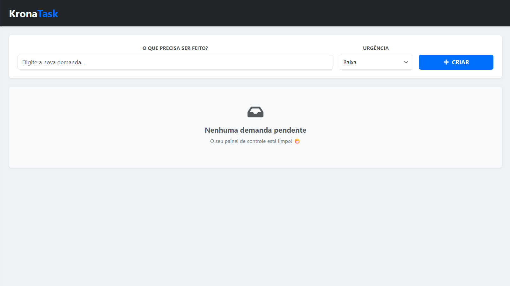

<h1 align="center">🔹 KronaTask — Gestão Eficiente de Demandas </h1>

<p align="center">
  O <strong>KronaTask</strong> é um ecossistema completo de gerenciamento de tarefas, desenvolvido com foco em alta performance, interface fluida (Ultra-Wide) e arquitetura Full Stack robusta.
</p>

<p align="center">
  Este projeto foi totalmente desenvolvido por mim, <strong>Jean Pedro</strong>.
</p>

<p align="center">
  
</p>

<p align="center">
  <a href="https://github.com/jjeanpedro03/KronaTask" target="_blank">
    
  </a>
</p>

## 🎯 Objetivo

O KronaTask foi projetado para simular um painel de controle corporativo real. O objetivo foi dominar o ciclo completo de uma aplicação (CRUD), garantindo que a experiência do usuário seja impecável tanto na persistência de dados quanto na fluidez da interface.

## 🚀 Sobre o Projeto

Uma aplicação Full Stack moderna que utiliza **React** no front-end e **Node.js** no back-end. Diferente de listas de tarefas comuns, o KronaTask utiliza um layout *Fluid Design*, ocupando 100% da largura da tela para maximizar a visualização de dados.

- 🖥️ **Interface Ultra-Wide:** Layout fluido que aproveita cada pixel do monitor.
- ⚡ **Full Stack Real:** Integração completa entre Front-end (React) e Back-end (Node/Express).
- 🎨 **UI/UX Premium:** Design limpo com modo "Fosco" e contraste inteligente de prioridades.
- 🛠️ **Gestão de Estados:** Sincronização em tempo real entre interface e banco de dados.

## 🛠️ Tecnologias Utilizadas

<p align="left">
  
</p>

- **React.js:** Componentização avançada e hooks (useState, useEffect).
- **Bootstrap 5:** Estilização responsiva e componentes de UI profissionais.
- **Node.js & Express:** API REST escalável e organizada.
- **MySQL:** Persistência de dados estruturada.
- **Axios:** Comunicação assíncrona entre o client e o servidor.

## ⚙️ Funcionalidades

- **CRUD Completo:** Criar, Listar, Atualizar status e Deletar demandas.
- **Níveis de Urgência:** Categorização visual por cores (Alta, Média, Baixa).
- **Confirmação de Segurança:** Modais de confirmação para evitar exclusões acidentais.
- **Sistema de Notificações:** Feedback visual via Toasts para cada ação do usuário.
- **Dashboard Limpo:** Tela de "Zero Demandas" personalizada com feedback positivo.

## 💡 Diferenciais Técnicos

- **Acessibilidade (A11y):** Formulários com labels associados e IDs únicos para leitores de tela.
- **Layout Fluid:** Uso de containers dinâmicos que se adaptam a monitores Ultra-Wide.
- **Clean Code:** Backend estruturado com separação clara de rotas e lógica de banco.
- **Visual Tech:** Identidade visual baseada em tons de Dark Gray, Blue e Off-white.

## 📂 Estrutura de Pastas

```text
├── frontend/
│   ├── src/
│   │   ├── components/
│   │   │   ├── TarefaForm.jsx
│   │   │   ├── TarefaLista.jsx
│   │   │   └── TarefaItem.jsx
│   │   ├── App.jsx
│   │   └── index.css
├── backend/
│   ├── index.js          # Servidor Express & Conexão SQL
│   └── package.json
└── database/
    └── schema.sql        # Estrutura das tabelas
